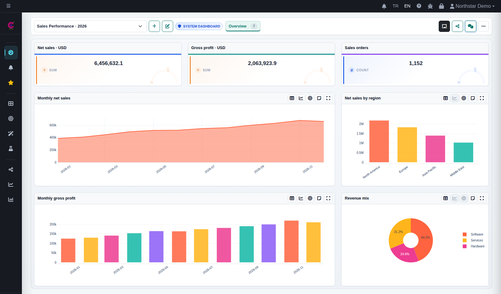
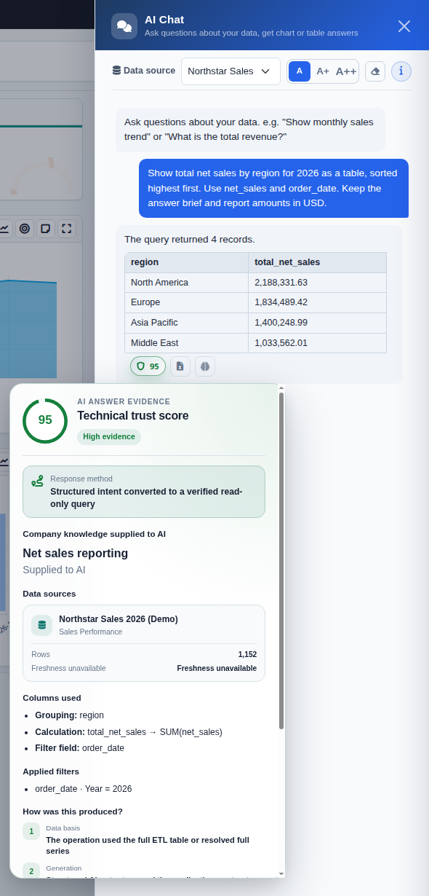
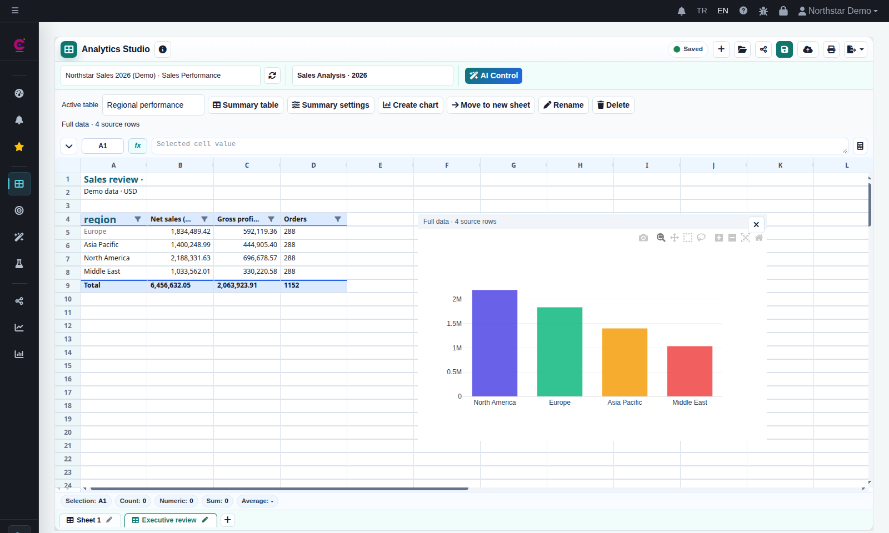

# LivChart AI Analytics

### AI analytics for teams that need control over their data.

Connect business data, define shared metrics, and turn questions into interactive dashboards and reports. Give teams AI-assisted analysis with subject-based access, inspectable answer evidence, and a choice of local or cloud AI providers.

**[Explore the demo](https://livchart.com/en#demo)** · **[Discuss your deployment](https://livchart.com/en#contact-form)** · **[Download LivChart](https://github.com/livchart/livchart/releases/latest)**

*Sales performance in one workspace. [Full-size application screenshot](assets/sales-dashboard.png), captured directly from LivChart 3.4.9 with a vivid chart palette. All examples use synthetic demonstration data.*

## From a business question to a shared decision

Imagine your sales team asking: **“Which regions are driving revenue, and how are we tracking through the year?”**

1. **Connect the data.** Bring in Excel/CSV files, database queries, or supported web services; prepare reusable ETLs in DataStudio.
2. **Define the business meaning.** Use the Semantic Layer for metric calculations and filters. Add Company Knowledge to explain terminology and business rules to AI.
3. **Build and refine the analysis.** Ask for charts or a multi-widget Dynamic Dashboard, then review the result and adjust the draft through the editor or Dashboard Chat.
4. **Inspect the answer.** Review the columns, applied filters, and method information available alongside the result.
5. **Share and monitor.** Save the dashboard, give the right users access, and configure scheduled PDF/email reports or threshold alerts.

## Controls that matter to business teams

| Your team's need | What LivChart provides |
| --- | --- |
| Consistent business metrics | A Semantic Layer for dimensions, measures, expressions, synonyms, and measure filters. |
| Shared business context | Subject-scoped Company Knowledge, with administrator review before saving definitions learned from a conversation. |
| Appropriate data access | User roles, subject-based authorization, personal workspaces, and controlled sharing of dashboards, charts, and workbooks. |
| Answers you can inspect | Technical evidence showing available calculation fields, applied filters, and answer methods. The technical trust score describes validation; it does not guarantee business correctness. |
| Visibility into operations | Activity logs for application operations, scheduled jobs, and system health checks. |
| Choice over AI processing | Configurable local and cloud providers, with data approval and identifier-masking controls for supported AI flows. |

Company Knowledge supplies context; it does not replace the Semantic Layer's calculation definitions. AI-generated analyses and changes remain reviewable before you rely on or save them.

## Ask questions where you work

Dashboard Chat can answer questions, return tables, generate charts, and create Dynamic Dashboards. In an editable dashboard, it can also update charts, widgets, pages, and supported interactions. Review the draft and save when it is ready.

*Inspect the analysis scope and export answer tables to Excel. Follow-up questions can reuse the previous chart context.*

## Explore, report, and plan

**Analytics Studio** brings prepared data into a spreadsheet-style workbook. Combine source-linked summary tables, pivots, calculations, charts, and notes; save the workbook and share it with authorized colleagues. Data-scope indicators distinguish full-data results from limited previews.

**Interactive dashboards** combine KPIs, charts, advanced pivots, filters, and drill-down. Desktop and mobile layouts, PDF output, and scheduled reporting support everyday use and management reviews.

**Optimization Studio** runs administrator-defined models for scheduling, sequencing, routing, and placement scenarios, with results published as ETLs for further analysis. Capabilities vary by model family; heuristic results do not guarantee the mathematical optimum, and planned capabilities are not available solver features.

[Explore product capabilities](https://livchart.com/en/features) · [Watch product walkthroughs](https://livchart.com/en/tutorials)

## Choose where your AI runs

| Option | How to evaluate it |
| --- | --- |
| Local AI with Ollama or LM Studio | Run supported model inference on your own device or network. Size the model and hardware for your workload. The [Local AI Starter](https://github.com/livchart/livchart-local-ai-starter) provides a separate Docker-based setup path. |
| Cloud or managed AI providers | Configure a supported provider. Review the data and context sent to that provider, along with approval and masking settings. |

Local AI describes where model inference runs. Activation, updates, optional online sources, and other configured services may still require network access. Feature availability and limits depend on the active license and configuration.

## Start your evaluation

1. **[Review plans](https://livchart.com/en#pricing)** and **[obtain a license](https://livchart.com/en/license)** for the capabilities you want to evaluate.
2. **Download and extract** the package for your operating system. Follow the [installation guidance](https://livchart.com/en/download) and complete initial setup and activation.
3. **Connect an AI provider** if you want AI-assisted features. Start with a non-sensitive Excel/CSV sample or an authorized prepared dataset.
4. **Create your first analysis** in Playground or Chart Wizard. Review its fields, calculations, and filters before saving.
5. For a team rollout, configure subjects, access, business definitions, and reporting with your administrator. [Discuss your deployment](https://livchart.com/en#contact-form).

| Platform | Latest application package |
| --- | --- |
| Windows | [Download ZIP](https://github.com/livchart/livchart/releases/latest/download/LivChart_Windows_Dist.zip) |
| Linux | [Download ZIP](https://github.com/livchart/livchart/releases/latest/download/LivChart_Linux_Dist.zip) |
| macOS | [Download ZIP](https://github.com/livchart/livchart/releases/latest/download/LivChart_MacOS_Dist.zip) |

[Release notes and SHA256 checksums](https://github.com/livchart/livchart/releases/latest) · [Tutorials](https://livchart.com/en/tutorials) · [Sales and support](https://livchart.com/en#contact-form)

## Official distribution and support

This is the official public release repository for LivChart. Application packages are distributed through GitHub Releases; the application source code is not published here. Downloading a package does not grant an open-source license. See the official website for licensing and commercial deployment details.

The application includes English and Turkish help for users and administrators. For support, use the in-app **Report Error** action or [contact LivChart](https://livchart.com/en#contact-form). Keep customer records and credentials out of public GitHub issues.

[LivChart](https://livchart.com/en) · [Liv Yazılım](https://livyazilim.com) · [All releases](https://github.com/livchart/livchart/releases)
